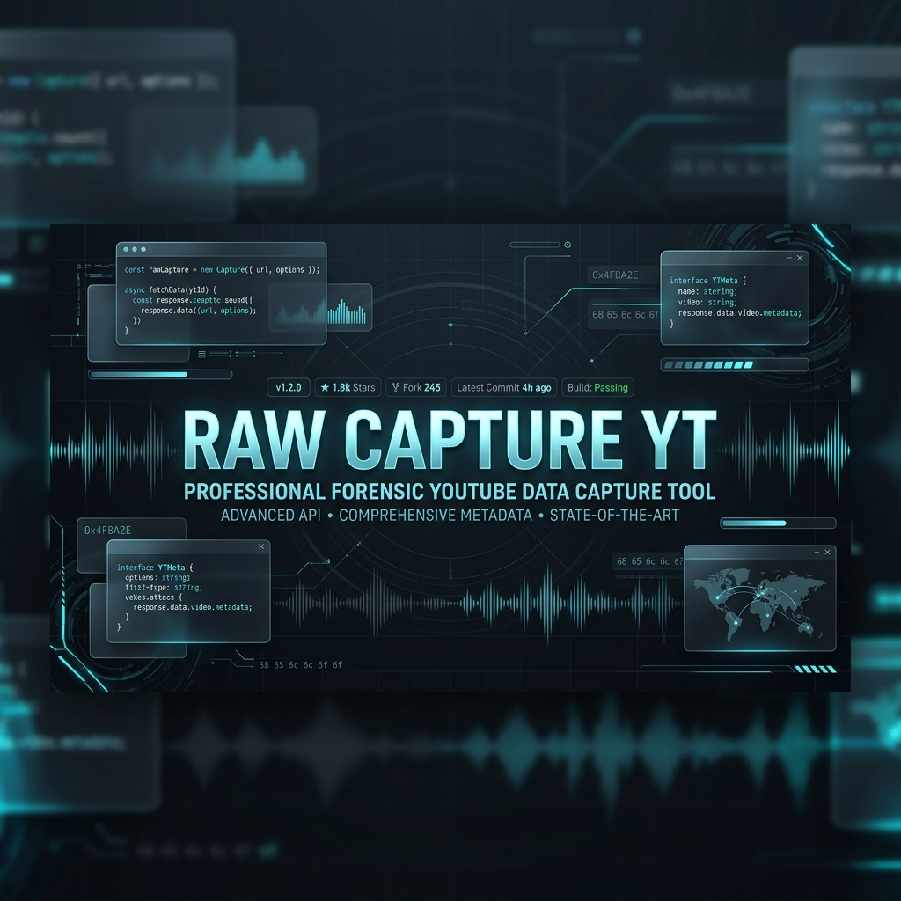

# Raw Capture YT
**The ultimate high-fidelity local transcript extraction suite.**

[What it is](#what-it-is) • [Key Features](#key-features) • [Quick Start](#quick-start) • [Workflows](#workflows) • [Safety](#safety-and-privacy)

---

> [!IMPORTANT]
> **Raw Capture YT** is designed for forensic-level transcript accuracy. It pulls data directly from your active browser session, allowing you to **get YouTube videos** and **download YouTube videos from members-only pages** with zero loss in fidelity. No summaries, no AI-washing—just the raw text.

## What it is

**Raw Capture YT** is a local-first toolchain for researchers, developers, and power users who need to **translate YouTube** content or **get a transcript for YouTube videos with no transcript**. By leveraging a secure browser bridge, it captures the exact caption streams used by the YouTube player, ensuring that even private or member-only content is accessible for transcription.

## Key Features

| Feature | Description | Use Case |
| :--- | :--- | :--- |
| **Session Capture** | High-fidelity extraction via browser bridge. | **Download YouTube videos from members-only pages** |
| **Line-by-Line Fidelity** | Zero summarization. Every word preserved. | **YouTube transcript** research and documentation |
| **Universal Translation** | **Translate YouTube** into any language pair. | Forensic analysis of multi-lingual content |
| **No-Transcript Capture** | **Get a transcript for YouTube videos with no transcript**. | Accessible captions for all video types |
| **Optimized Output** | Cleaned for "Read Aloud" and accessibility. | **Create transcripts for YouTube audio** for reading flow |

## Quick Start

### 1. The Bridge
- Open `chrome://extensions` in Chrome or Edge.
- Enable **Developer mode**.
- Click **Load unpacked** and select the `extension/` folder.

### 2. The Capture
- Open any YouTube video.
- Click the **Raw Capture** icon and hit **Capture Transcript**.
- A `.vtt` file will be saved to your downloads.

### 3. The Extraction
- Open the `tools/` folder.
- Right-click `Start-Here.ps1` and select **Run with PowerShell**.
- Find your finished transcript in the `output/` folder.

## Workflows

We provide specialized documentation for every type of user:

- 👤 **[For Humans (Usage Guide)](docs/usage.md)**: Full technical manual for power users.
- 👶 **[For Beginners (Simple Start)](docs/simple-start.md)**: No-code, step-by-step instructions.
- 🤖 **[For AI Agents (AGENTS.md)](AGENTS.md)**: Metadata for automated tools and coding assistants.

## Safety and Privacy

- **Local Only**: No data ever leaves your machine. No cloud APIs, no tracking.
- **Session Secure**: Uses your existing browser session—no need to provide passwords.
- **Non-Destructive**: Does not bypass platform security or DRM. 

---

Built by <b>x0VIER</b> for the open-source community.

