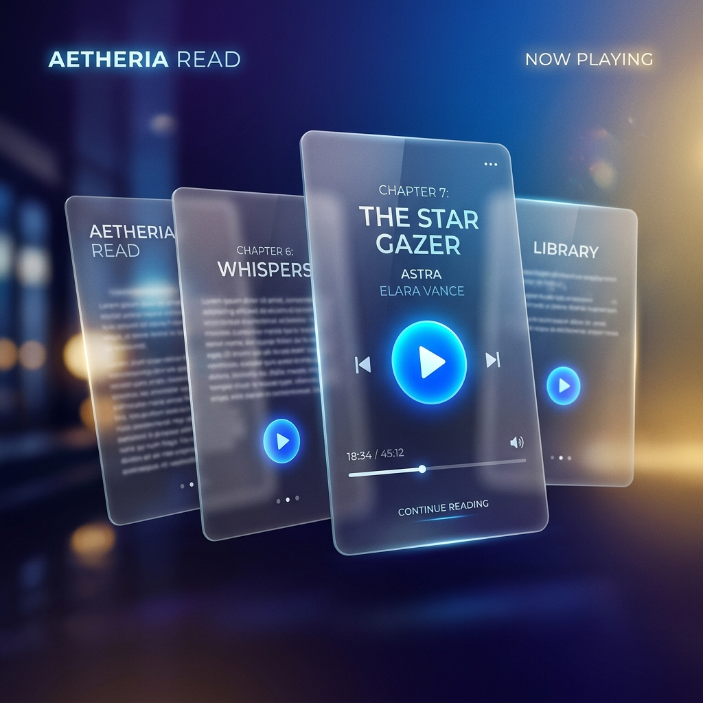

# Universal-Word-Suite 📖🌍

## Overview
**Universal-Word-Suite** is an industrial-grade language translation and word processing ecosystem. This tool is for orchestrating 100% literal parity translations for forensic book audits and high-fidelity YouTube content processing. Optimized for edge read-aloud and zero-summarization standards.

## 🛠️ Industrial Features
- **Forensic Book Translation**: Industrial pipeline for scanned book processing with 100% literal parity.
- **VTS Pipeline**: YouTube translation engine optimized for edge-readability and high-throughput captioning.
- **Context Preservation**: Advanced context-security layer ensuring zero PII leakage during translation.
- **Glassmorphic Interface**: High-fidelity UI for managing translation manifests and technical protocols.

## 📂 Structure
- `tools/`: Core translation engines (OCR, Whisper, VTS).
- `extension/`: Browser-based orchestration tools.
- `docs/`: Forensic translation standards and industrial manifests.
- `tests/`: Parity validation and technical audit logs.

## 🚀 Quick Start
Refer to the `AGENTS.md` for specific forensic workflows or the `docs/` folder for one-click setup instructions.

## 📜 Industrial License
Proprietary Industrial Suite. Optimized for x0VIER Forensic Operations.
