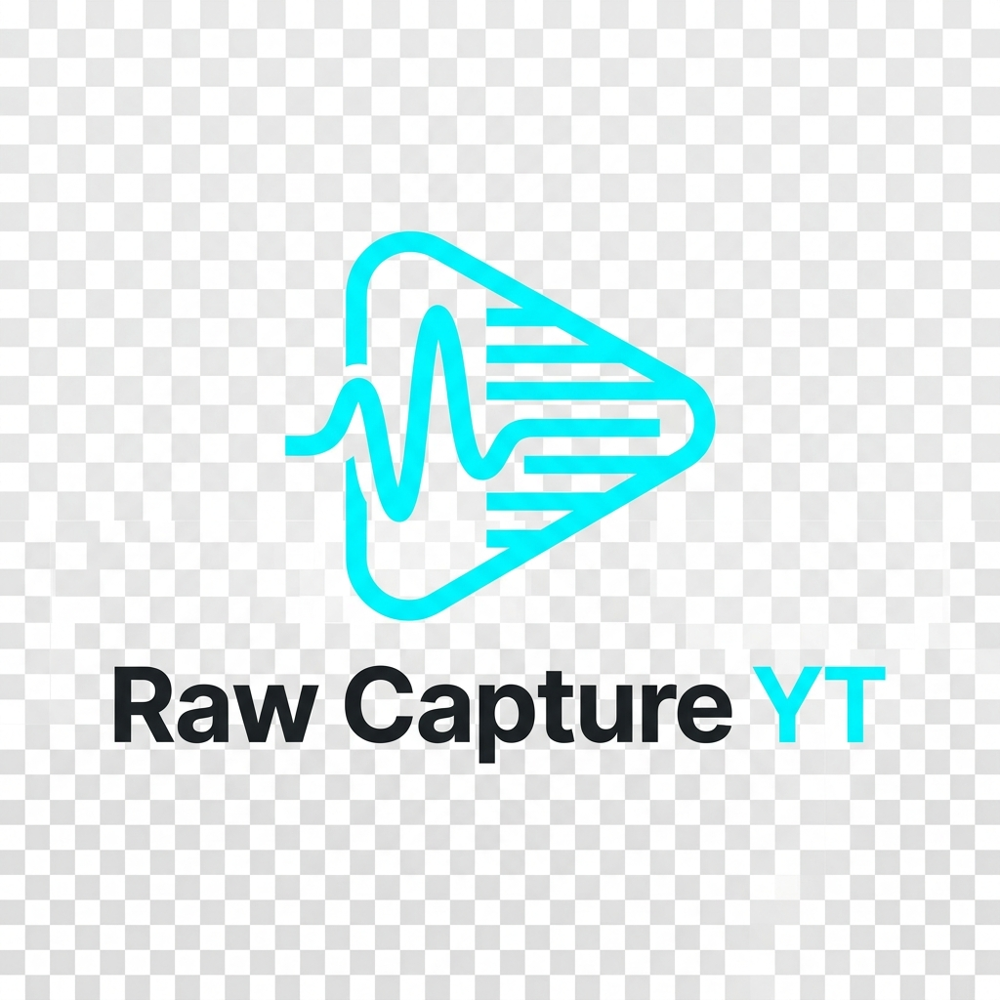

# Raw Capture YT

**Raw Capture YT** is a high-fidelity local tool built for professionals and researchers who need to **get YouTube videos** and **download YouTube videos from members-only pages** as clean, line-by-line transcripts. 

It provides a seamless way to **translate YouTube** content and **get a transcript for YouTube videos with no transcript** by leveraging your active browser session.

## Why Raw Capture YT?

Most tools "summarize" or "AI-wash" your data. Raw Capture YT is different. It uses **YouTube video audio to get transcripts** directly from the source caption tracks, ensuring you get the raw truth without the fluff. Whether you need to **create transcripts for YouTube audio** for research or just want a cleaner reading experience, this is the tool for you.

## Workflows

We have prepared three distinct ways to get started, depending on who you are:

- **[For Humans (The Standard Guide)](docs/usage.md)**: Detailed technical instructions for developers and power users.
- **[For Non-Technical People (The "Easy" Guide)](docs/simple-start.md)**: Extremely simple, step-by-step instructions for beginners.
- **[For AI Agents (System Instructions)](AGENTS.md)**: Specialized metadata for AI assistants (like ChatGPT, Gemini, or Claude) to understand and run the repo.

## Key Features & SEO Keywords

- **Get YouTube videos** and transcripts with 100% fidelity.
- **Download videos** and caption tracks directly from your authenticated session.
- **Download YouTube videos from members-only pages** using the Browser Bridge.
- **Translate YouTube** line-by-line into any language.
- **Get a transcript for YouTube videos with no transcript** by capturing hidden caption streams.
- **YouTube transcript** extraction with precise timestamps.
- **Video capture** for forensic-level documentation.
- **Create transcripts for YouTube audio** optimized for Edge "Read Aloud".
- **YouTube video audio to get transcripts** without relying on third-party APIs.

## Requirements

- **OS**: Windows 10 or 11.
- **Browser**: Chrome or Edge (for the **Raw Capture Bridge** extension).
- **Environment**: Python 3.10+ and PowerShell.

## Quick Start (The Fast Way)

1. **Install the Extension**: Load the `/extension` folder into your browser.
2. **Capture**: Click the "Capture Transcript" button on any YouTube video.
3. **Extract**: Right-click `tools/Start-Here.ps1` and choose **Run with PowerShell**.

---

### Safety and Privacy Note
This tool is intended for personal use with videos you are allowed to access. It does not bypass paywalls, DRM, or platform security. All data stays on **your** machine—no cloud, no tracking, no risk.
